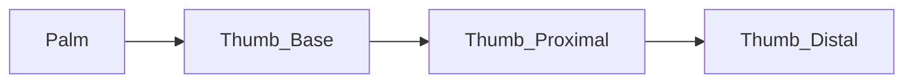

# Hand Model

The dexterous hand is modeled as a kinematic tree. 

Each finger consists of multiple joints, typically covering flexion/extension and abduction/adduction.

Refer to the [`Finger` API reference](../api-reference/finger.md) for the joint naming conventions and ranges.
