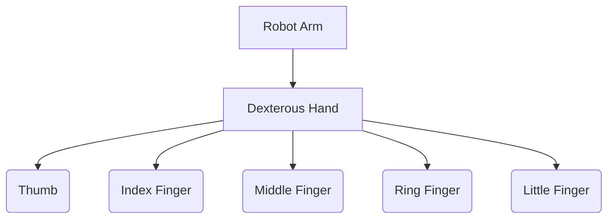

# Overview

A dexterous hand mimics the complexity of a human hand, enabling robots to perform fine manipulation tasks that standard parallel grippers cannot handle.

By providing independent control over multiple joints across 5 fingers, the Linkerbot series hands unlock advanced use cases in imitation learning, teleoperation, and autonomous grasping.

Refer to the [`Hand` API class](../api-reference/hand.md) for software control details.
