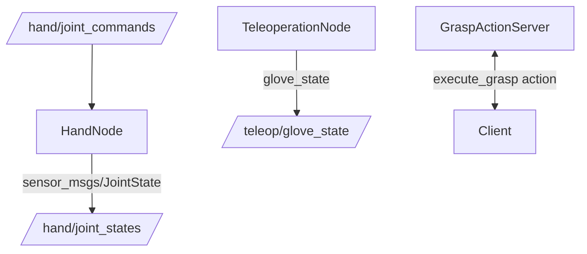

# ROS 2 Integration Overview

The Stonedrum Robotics ROS 2 packages expose the Python SDK over standard ROS interfaces.

## Architecture

The ROS 2 integration serves as a bridge between the high-level Python SDK and the distributed ROS 2 ecosystem. At its core, the `HandNode` directly wraps the SDK's driver interface (such as `Hand.mock()` or a hardware driver), translating ROS `sensor_msgs/JointState` commands into native joint movement instructions. Simultaneously, it reads telemetry from the hand at a fixed rate and publishes it to the ROS network. The `TeleoperationNode` and `GraspActionServer` layer on top of this, converting human-input formats (like a glove frame) or high-level action goals (like "pinch") into standard joint commands that the `HandNode` can digest. This modular architecture allows developers to swap the underlying hardware driver seamlessly without affecting the broader robotics stack.

## When to use ROS 2 vs Python SDK

Choosing between the native Python SDK and the ROS 2 integration depends largely on the scope of your project.

**Use the Python SDK when:**
- You are writing standalone scripts, simple automation, or unit tests.
- You want to eliminate network overhead or avoid complex middleware setups.
- You are running on embedded systems where resources are tightly constrained.

**Use the ROS 2 Integration when:**
- You need to visualize the hand in RViz.
- You are planning trajectories using MoveIt 2.
- You are integrating the hand with other robotic components like a robotic arm, mobile base, or external vision systems.
- You require distributed logging, parameter management, or recording data to ROS bags.

## Prerequisites

To use the Stonedrum Robotics ROS 2 packages, ensure your system meets the following requirements:

- **Operating System:** Ubuntu 22.04 or Ubuntu 24.04 (depending on the ROS 2 distribution).
- **ROS 2 Distributions Supported:** 
  - ROS 2 Humble Hawksbill
  - ROS 2 Iron Irwini
  - ROS 2 Jazzy Jalisco
- **Python:** Python 3.10 or higher.
- **Dependencies:** The base `dexterous_hand` Python SDK must be installed and importable in your Python environment. You will also need standard ROS 2 message packages such as `sensor_msgs` and `action_msgs`.

If you have questions or encounter issues, please contact us at info@stonedrum.co.
