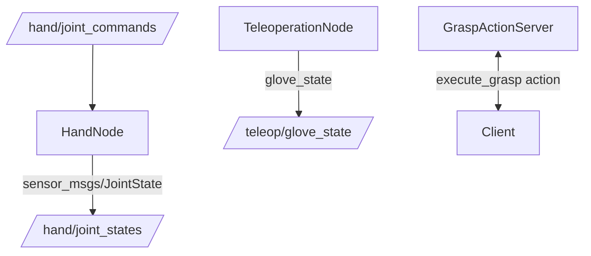

# ROS 2 Integration Overview

The Stonedrum Robotics ROS 2 packages expose the Python SDK over standard ROS interfaces.

These nodes abstract hardware complexities and enable standard ROS tools like RViz and MoveIt 2.
